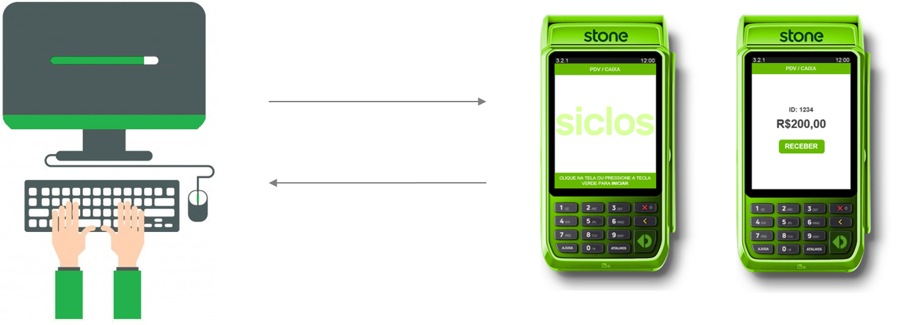
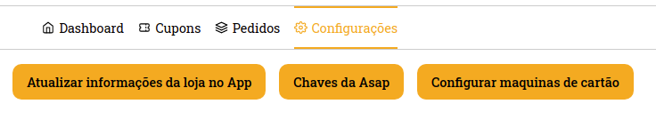
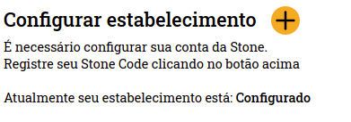
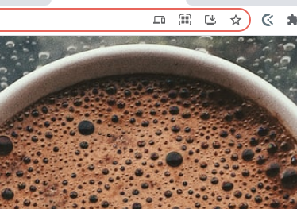
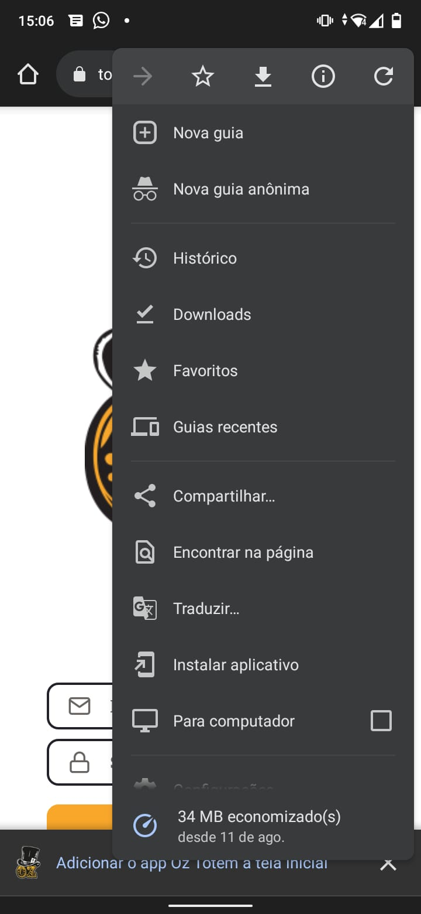

# Oz CMS - Cadastro Stone

Seja bem vindo(a) à documentação para realizar o cadastro de Pos Stone.

## Preview

## Stone

Para dar continuidade é necessário possuir um cadastro com a Stone

[Portal Stone](https://conta.stone.com.br/login)

## Vinculando conta Stone

Agora é necessário vincular sua conta Stone com o sistema da Oz, para isso siga as etapas a seguir:

- Tenha em mãos o Stone Code, [disponível aqui](https://ajuda.stone.com.br/onde-encontro-meu-stonecode);
- Acesse o portal Oz CMS, [disponível aqui](https://cms.ozcandy.com.br/);
- Vá na aba de **Configurações**
- Selecione **Configurar maquinas de cartão**;

- Clique no botão **+** (mais), ao lado de Configurar estabelecimento;
- Preencha as informações;
- Clique em cadastrar.

> **ATENÇÃO**: As informações do formulário precisam ser as mesmas cadastrar com a Stone.

Pronto, seu estabelecimento está vinculado com a Oz.

## Vincular POS(máquina de cartão)

O vínculo de uma POS é feito apenas **uma vez** e com apenas **um** funcionário, ou seja, um funcionário só consegue utilizar uma única POS.

Para realizar o vincúlo é necessário que o aplicativo **Stone Connect** esteja instalado em sua POS, para instalar siga as seguintes etapas em sua POS:

- +Apps;
- Procure por **Stone Connect**;
- Clique sobre **Stone Connect**;
- Clique em instalar;

> **ATENÇÃO**: Caso o aplicativo não esteja listado para você, aguarde o status no sistema ficar **Configurado**, exemplo: 

Agora é possível configurar sua POS, siga as seguintes etapas:

- Abra o aplicativo **Stone Connect** em seu POS;
- Acesse o portal Oz CMS, [disponível aqui](https://cms.ozcandy.com.br/);
- Vá na aba de **Configurações**
- Selecione **Configurar maquinas de cartão**;
- Clique no botão **+** (mais), ao lado de Configurar maquina de cartão;
- Selecione um funcionário;
- Selecione a POS;
  - Para identificar a POS correta, utilize o **Serial Number** mostrado na tela da sua POS.
- Clique em cadastrar;

Pronto, sua POS está configura e pronto para o uso;

## Como usar

Para utilizar a nova POS é necessário instalar a nova versão do sistema Oz Totem, siga as seguintes etapas:

- Abra o novo Oz Totem, [disponível aqui](https://totem-web.vercel.app/), no dispositivo que deseja usar como Totem;
  - De preferencia utilize o navegador **Google Chrome na última versão**;
- Intale o aplicativo;
  - Para computadores, utilize o terceiro icone, da esquerda para direita: 
    - 
  - Para dispositivos móveis, utilize a opção em tela ou a opção disponivel em configurações:
    - 
- Após concluir a instalação feche o navegador;
- Abra o aplicativo **Oz Totem** instalado em sua área de trabalho/lista de aplicativos
- Utilize as credencias do funcionário vinculado com a POS para acessar o sistema;

Pronto, utilize o nova versão do sistema.

## Considerações

Caso algum produto não esteja em sua listagem no Oz Totem, consulte o estoque dele no ERP.

## FAQ

- Em caso de dúvidas entrar em contato com a equipe da Oz
